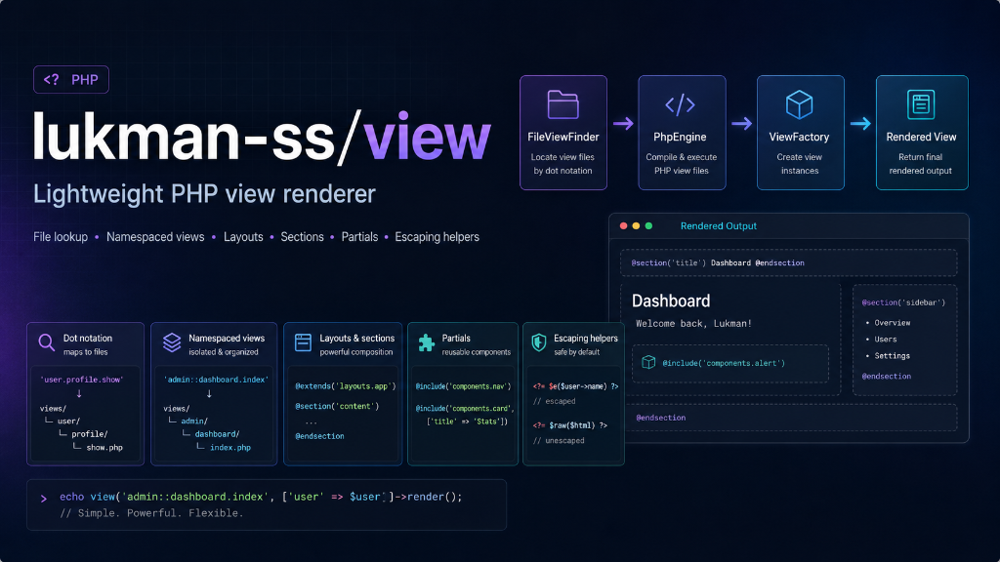

# Lukman View (`lukman-ss/view`)



A lightweight PHP view renderer with file lookup, namespaced views, layouts, sections, partials, and escaping helpers.

## Requirements

- PHP >= 8.2

## Installation

```bash
composer require lukman-ss/view
```

## Usage

```php
use Lukman\View\FileViewFinder;
use Lukman\View\PhpEngine;
use Lukman\View\ViewFactory;

$finder = new FileViewFinder([__DIR__ . '/views']);
$engine = new PhpEngine();
$view = new ViewFactory($finder, $engine);

echo $view->render('home', ['name' => 'Lukman']);
```

`views/home.php`:

```php
Hello, <?php echo $e($name); ?>
```

## View Names

Dot notation maps to paths:

```php
echo $view->render('pages.home');
```

This resolves `views/pages/home.php`.

Namespaced views:

```php
$finder->addNamespace('admin', __DIR__ . '/views/admin');

echo $view->render('admin::dashboard.index');
```

## Shared Data

```php
$view->share('appName', 'Demo');
$view->share(['locale' => 'en']);

echo $view->render('home', ['appName' => 'Override']);
```

Render data overrides shared data.

## Layouts and Sections

`views/layouts/app.php`:

```php
<title><?php echo $section('title', 'Default'); ?></title>
<main><?php echo $section('content'); ?></main>
```

`views/home.php`:

```php
<?php $extend('layouts.app'); ?>

<?php $start('title'); ?>Home<?php $end(); ?>

<?php $start('content'); ?>
Hello, <?php echo $e($name); ?>
<?php $end(); ?>
```

## Partials

```php
<?php echo $include('partials.card', ['title' => 'Profile']); ?>
```

Included views receive parent data. Additional include data overrides parent data.

## Escaping

```php
<?php echo $e($value); ?>
<?php echo $raw($html); ?>
```

`$e()` escapes with `htmlspecialchars` using `ENT_QUOTES | ENT_SUBSTITUTE` and UTF-8. `$raw()` returns unescaped string output.

## Exceptions

- `Lukman\View\Exception\ViewNotFoundException`
- `Lukman\View\Exception\ViewException`

## Running Tests

```bash
composer test
```
